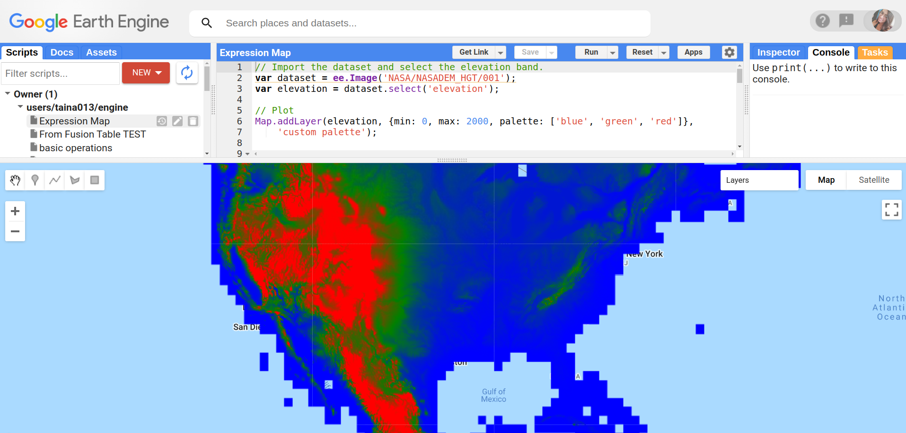
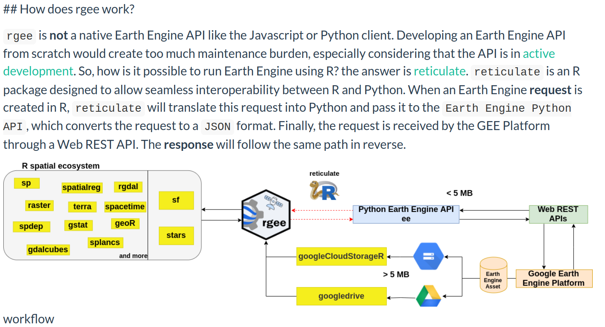

class: title-slide, left, middle
background-image: url("images/rgee-hex.png")
background-position: 85% 50%
background-size: 30%
background-color: #F9F8F3

.pull-left[

# `r rmarkdown::metadata$title`

### `r rmarkdown::metadata$author`

### `r rmarkdown::metadata$org`

### `r rmarkdown::metadata$date`
]

???

Olá me chamo Tainá, sou bióloga de formação, fiz um mestrado em biologia ambiental pela UFPA e doutorado em zoologia pelo Museu Emílio Goeldi. Atualmente sou pesquisadora, eu atuo no lab de universidade estadual da Florida. E também  sou consultora do Centro Nacional de Conservação da Flora Brasil do Jardim Botânico do RJ.
E resumidamente eu faço pesquisas com foco em biodiversidade e mudanças globais (principalmente mudanças climáticas). E uma ferramenta que tenho explorado é o rgee (um pacote em R para acessa o plataforma Earth Engine). Então a ideia é compartilhar com vocês essa experiência.  

---
class: middle, center

# Roteiro

.columns[

.left-col[
### Google Earth Engine (GEE) 


]

.middle-col[
### rgee


]

.right-col[
### Estudos de caso (no R)


]
]

???

Então, vou começar falando brevemente sobre o que é o Google Earth Engine, depois o rgee e o fluxo de trabalho do pacote, e fecho com estudos de caso no R
---
class: middle 

#### GEE

```{r url 1, echo=FALSE}
knitr::include_url("https://earthengine.google.com/", height = 450)
```
.footnote[https://developers.google.com/earth-engine/datasets/"]

???

- Bom, basicamente o GEE é dos serviçoes do google, é uma plataforma que além de hospedar dados geoespaciais, oferece uma infraesturtura para análise desses dados. 
- Essa é a página inicial do GEE e você encontra várias informações interessantes,sobre como funciona essa infraestrutura. Econtra também informações sobre os dados. Clicando aqui vocês são direcionados para a página do catálogo de dados, onde você podem acessar os mais diferentes tipos de dados, ou procurar por algum por outros dados. Enfim, é uma das seções que eu mais utilizo.
- E o  grande potencial da plataforma, pelo menos até agora é possibilidade de acessar gratutitamente um serviço de alta pefomance, isso pq além de acessar gratuitamente os dados que estão estão cada vez mais em alta resolução, você consegue realizar análises de alta complexidade que requer poder de processamento. E agora eu volto para os slides.
---
#### Volume de dados | Resolução de dados -> Demanda por processamento de alta perfomance 

```{r res, echo=FALSE, out.width="62%", fig.align="center"}
knitr::include_graphics("images/res.png")
```
???
- Pra exemplificar isso essa figura mostra dados to tipo raster, dados matricias. E Basicamente é uma imagem composta por pixeis, onde cade pixel carrega uma informação, nesse caso aqui é informaçõa de temperatura, ou seja eu tenho valores de temperatura para cada pixel.  E numa resolução baixa/grosseira os pixeis são maiores, mas estão menor quantidade, ou seja eu vou ter poucos valores para serem analisados ou processados. Já um dados em alta resolução número de pixeis aumenta exponencialmente, e aí a gente passa a ter muito valores para analisar e processar.... o que gera uma demanda por alta perfomance. E daí a importância da plataforma como Engine que te oferece gratuitamente essa infraestrutura. 
---

#### Infraestrutura do GEE - JavaScript ou Phyton 

--
```{r cejs, echo=FALSE, out.width="100%", fig.align="center"}

```
.footnote[https://code.earthengine.google.com/"]
???
Contudo, a google disponibiliza este serviço em Javascript ou Phyton... Na verdade o editor próprio da plataforma engine e em JS. E isso acaba gerando alguma restrição para quem não tem habilidade com essas linguagens. 

---
class: middle 
background-image: url(images/rgee-hex.png)
background-position: 50% 5%
background-size: 5%


```{r paper, echo=FALSE}
knitr::include_url("https://www.theoj.org/joss-papers/joss.02272/10.21105.joss.02272.pdf", height = 450)

```
???
- E foi assim que esse grupo de pesquisadores de diferentes departamentos criaram a alternativa em R para o acesso ao Google Earth Engine. Para nossa sorte. 

- Aqui nesse artigo vocês econtram várias informções sobre o rgee. E o pacote também já está no cran. 
---
class: top, center

#### Workflow 
```{r workflow, echo=FALSE, out.width="80%", fig.align='center'}

```
.footnote[https://r-spatial.github.io/rgee/"]
???
- Esse aqui é fluxo de trabalho do rgee. E resumidamente, o rgee feito em R, conversa muito bem com os principais pacotes R de análises espaciais , que ele chama aqui de ecossistema espacial R. Mas o rgee consegue também conversar com API Python do Earth Engine, graças ao pacote reticulate, que traduz tudo o que é feito no rgee, que na verdade são requisições feitas no rgee que o reticulate traduz para a API python e API por sua vez transforma essa requisição em um JSON que é o formato aceito aqui na plataforma Earth Engine . 

---
#### Referências

- Aybar, C., Wu, Q., Bautista, L., Yali, R., & Barja, A. (2020). rgee: An R package for interacting with Google Earth Engine. Journal of Open Source Software, 5(51), 2272.

- [Documentação](https://cran.r-project.org/web/packages/rgee/vignettes/rgee01.html)

- [Tutorial](http://www.css.cornell.edu/faculty/dgr2/_static/files/R_html/ex_rgee.html)

- [Repositório](https://github.com/r-spatial/rgee)

- [rgeeExtra](https://r-earthengine.com/rgeeExtra/), extensão para o rgee 
???
 - Nas referências eu deixei vários conteúdos com informações mais detalhadas.
 - E agora eu vou pro R , mostrar um pouco o que dá pra fazer com o rgee.

---
name: hello
class: middle, center, inverse


### `r rmarkdown::metadata$author`


### `r rmarkdown::metadata$role`

### `r rmarkdown::metadata$org`

[`r fontawesome::fa("github")` @Tai-Rocha](https://github.com/Tai-Rocha)    
[`r fontawesome::fa("twitter")` @Tai_Rocha_](https://twitter.com/Tai_Rocha_)   
[`r fontawesome::fa("link")` tainaweb-en.netlify.app](https://tainaweb-en.netlify.app/)

???

- Conta do Google com o Earth Engine ativado

- Python >= v3.5

- EarthEngine Python API (Python package)

???

### Esse é o roteiro do código:
1- Eu vou falar das instalações 
2- Falerei também das funções que precisam ser executadas sempre inciarmos um seção no R/Rstudio e vou já aporveitar p/mostrar a sintaxe da pacote
3- Termino com 3 estudos de caso. Su eu me prolongar vou me ater a 2 estudos de caso, mas eu está com estudos de caso. 

### Sobre as instalações, existem dois requisitos:
1- Conta no Google com Earth Engine ativado
2- E também ter o Python instalado na sua máquina na versão >= v3.5

- Com esses requisitos, já se pode executar no R ou Rstudio com o install.packages rgee para primeira parte da instalação. No geral esse comando só é necessaŕio uma vez, pq uma vez instalado, ele fica na sua máquina. A menos que vc formate seu computador ou reinstale o R e situações do tipo. Inclusive eu não vou executar esse comando porque rgee já está instalado aqui na minha máquina.

- Porém, pra conseguir usar plenamente o rgee, ou seja, usar todas funções, outras instalações são necessárias. E essas instalações se fazem com uma função do próprio rgee ee_install que no geral também só precisa ser executada uma vez. E também não vou executar esse comando. Mas só pra saber do que se trata, o ee_install cria um ambiente virtual phtyon para instalar as dependencias necessárias. E são elas Numpy e ee.

- Detalhes sobre a instalaçao disponíveis nas referências da apresentação

### Segunda parte
Essa segunda parte é bem curtinha. É SÓ pra vocẽs terem em mente que existem algumas funções que precisamos executar sempre, nesse caso, a cada vez que você abre e inicia uma nova seção do R e Rstudio  

o library é o mais óbvio porque carrega o pacote que já instalado, mas eu costumo usar a sintaxe rgee::seguido da função e isso dispensa o carregamente via library. Mas o usuário fica avonatde pra usar o que preferir.

Então pra turma do library, além de carregar o pacote, sempre q inciar uma seção e for usar o rgee

é de bom tom começar com rgee:: ee_chech... que vfará um check da dependecia em phtyon. Executando  esse comando, aqui esta tudo ok ele me diz q está tudo ok ... ou seja, teoricanete eu vou consegui usar todas a funções.

O outro comando é ee_Initialize e esse aqui é orbigatŕoio cada vez vc abre ser R/Rstudio... você só vai conseguir usar o rgee com esse comando. Vamos dar uma olhada no que faz esse comando.... o ee-intitilaize nada mais é do que uma autenticação para autorizar o acesso do rgee aos serviços do Earth Engine, Google drive, google cloud ... e isso pq as opções para salvar os resultados das suas análises é via google drive ou cloud storage.

Bom dito isso, vamos executar o comando para começar usar o rgee.
quando está tudo verdinho é pq está tudo ok. Então podemos começar. 

E eu vou começar mostrando a sintaxe do rgee.
Você verão que todas as funções do rgee omeção com ee_  e como eu ja carreguei o pacote se eu digitar esse prefixo aparece essa caixa com todas as funções do pacote.

Outra maneira como já mostrei é usando rgee:: e bovamente abre a caixa com todas as funções, mas observem que agora existe uma outra classe de função que começa com ee, na verdade veremos que é ee$ifrão. Mas só pra entender melhor a diferença o eeSifrão são as funções originais do Earth Engine, já as funções ee_ são nativamente em R.

E só pra vocês verem aqui nesse exemplo ... essas funções tem instancias. Por exemploo Classifer que uma função para classifcação supervsionada...e aí vcê pode acessar diferntes classificadores por exemplo o maxente . e ai vcê entra com argumentos desse clafficador os parãmetros.

o ee_ e como o pacote já está carregado e abre automaticamete a caixa mostrando todas as funções

### E agora finalemnte chegamos nos estudos de caso onde veremos o uso do rgee na vida real e sua utilidade. 

Alguns são exemplo da documentão outros são modifcados, mas exemplo sã exemplos que usei relamente nas minhas alíses pricnipamen o estudo de caso 1 .


